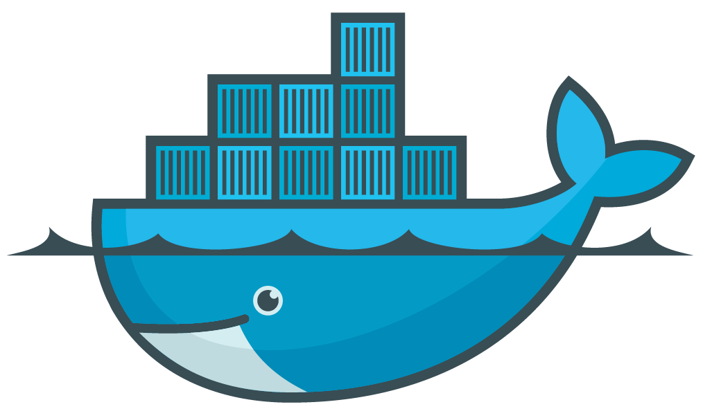
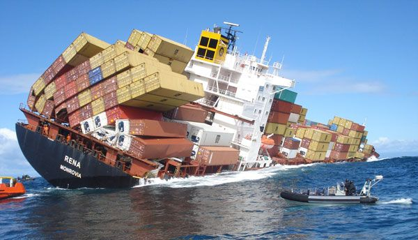
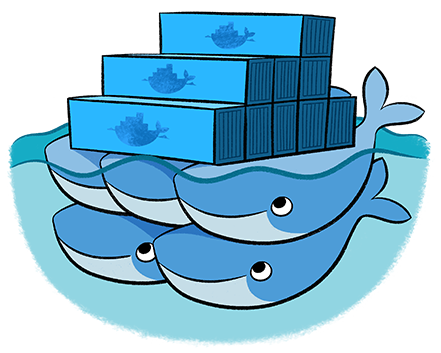
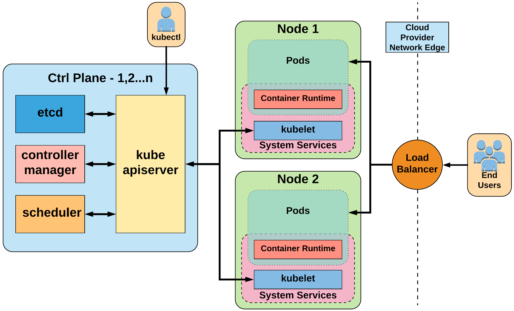
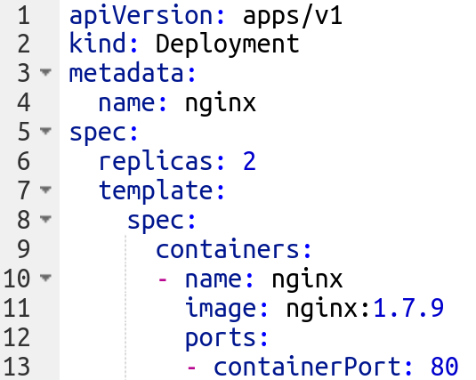

## Kubernetes: The Key to Hassle-Free and Durable Applications

_by_

Keyvan - Shovel Engineer

June 2023

---

## Introduction

- We know about the Docker <!-- .element: class="fragment" data-fragment-index="1" -->
- Enter Kubernetes <!-- .element: class="fragment" data-fragment-index="2" -->
- Demo <!-- .element: class="fragment" data-fragment-index="3" -->
- Challenges <!-- .element: class="fragment" data-fragment-index="4" -->
- Questions <!-- .element: class="fragment" data-fragment-index="5" -->

---

## We know about the Docker and containers

--

 <!-- .element: height="250" -->

- You put the applications inside containers <!-- .element: class="fragment" data-fragment-index="1" -->
- Containers are isolated from each other <!-- .element: class="fragment" data-fragment-index="2" -->
- You ship the containers via Docker <!-- .element: class="fragment" data-fragment-index="3" -->
- Docker manages the containers in one machine <!-- .element: class="fragment" data-fragment-index="4" -->

--

### Sometimes things go wrong

 <!-- .element: height="500" -->

--

### Sometimes things go wrong

 <!-- .element: height="500" -->

--

### Sometimes things go wrong

 <!-- .element: height="500" -->

--

## Solution?

--

## Redundancy

 <!-- .element: height="250" -->

- Use multiple machines <!-- .element: class="fragment" data-fragment-index="1" -->
- When one machine goes down containers will be migrated to another machines <!-- .element: class="fragment" data-fragment-index="2" -->
- But Docker can manage containers only in one machine <!-- .element: class="fragment" data-fragment-index="3" -->

---

# Enter Kubernetes

--

 <!-- .element: height="250" -->

- In Greek Kubernetes means "governor", "helmsman" or "captain" <!-- .element: class="fragment" data-fragment-index="1" -->
- As the name suggests it’s the governor for containers and will manage the containers in multiple machines <!-- .element: class="fragment" data-fragment-index="2" -->
- It’s a container-orchestration solution <!-- .element: class="fragment" data-fragment-index="3" -->

--

## Architecture review

Note:
This diagram isn't very accurate but it's simple enough to explain things
Define what a node is
Define what a pod is

--

## Key Feature of Kubernetes

- Managing nodes <!-- .element: class="fragment" data-fragment-index="0" -->
- Move applications when node is unavailable or out of resources <!-- .element: class="fragment" data-fragment-index="0" -->
- Auto scaling applications and nodes <!-- .element: class="fragment" data-fragment-index="1" -->
- Based on CPU, Memory and custom metrics <!-- .element: class="fragment" data-fragment-index="1" -->
- No vendor lock in, easily move between different providers <!-- .element: class="fragment" data-fragment-index="2" -->
- Service discovery & Load balancing <!-- .element: class="fragment" data-fragment-index="3" -->
- Security measurements <!-- .element: class="fragment" data-fragment-index="4" -->
- Namespaces <!-- .element: class="fragment" data-fragment-index="4" -->
- Security and Network Policies <!-- .element: class="fragment" data-fragment-index="4" -->
- Zero-downtime deployments <!-- .element: class="fragment" data-fragment-index="5" -->

--

# Hello world!

---

# Enough theory!

# Show me action!

--
Let's get a list of nodes in our cluster

    <!--
    {
        "URL": "demo/nodes.cast"
    }
    -->

--
Let's install Wordpress

    <!--
    {
        "URL": "demo/apply.cast"
    }
    -->

--
Let's customize it

    <!--
    {
        "URL": "demo/custom-columns.cast"
    }
    -->

--
Let's break it

    <!--
    {
        "URL": "demo/break.cast"
    }
    -->

--

Let's try to access it

    <!--
    {
        "URL": "demo/port-forward.cast"
    }
    -->

--
Let's scale it

    <!--
    {
        "URL": "demo/scale.cast"
    }
    -->

---

# Challenges

- Steep learning curve <!-- .element: class="fragment" data-fragment-index="0" -->
- Complexity of setup and maintenance <!-- .element: class="fragment" data-fragment-index="1" -->
- Security concerns <!-- .element: class="fragment" data-fragment-index="2" -->

Note:

- It's a complex system with a myriad of components and concepts that users need to understand to effectively use the platform.
- While Kubernetes automates many tasks, it requires careful configuration and tuning to ensure optimal performance. It can also be difficult to troubleshoot and diagnose problems when they occur due to the distributed nature of the platform.
- While Kubernetes has robust security features, it also presents a large attack surface. Misconfigurations can lead to vulnerabilities, and the dynamic nature of the system can make it difficult to monitor and detect security incidents. It's essential to follow best practices for securing Kubernetes deployments, such as using role-based access control, securing the Kubernetes API server, and regularly updating and patching the system.

---

# Questions

---

# End
